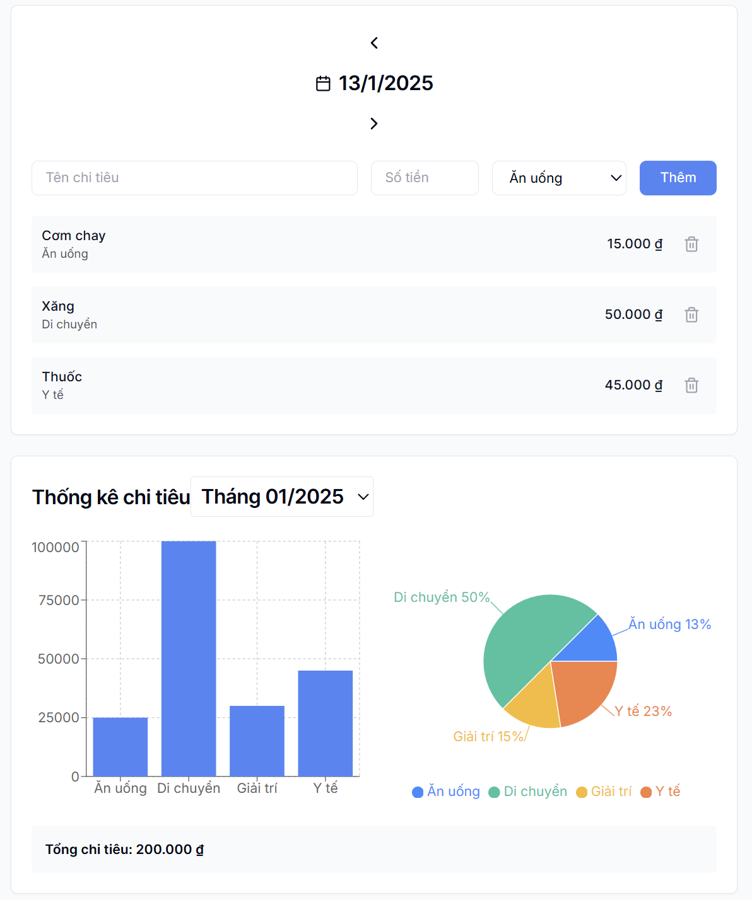

# Expense Tracker

[Check out the live app here](https://simplest-expense-tracker.vercel.app/)

## Overview

The **Expense Tracker** is a web-based application designed to help users manage their daily expenses. The app supports:

- Adding and categorizing expenses.
- Viewing daily expenses.
- Analyzing monthly spending with bar and pie charts.
- Storing data locally using `localStorage`.

## Features

### 1. Add Expenses

- Users can input expense details, including:
  - Name of the expense.
  - Amount.
  - Category (e.g., Food, Transportation, etc.).
- Expenses are recorded with a timestamp and stored locally.

### 2. Daily Expense Overview

- Displays a list of all expenses recorded for the selected day.
- Each expense shows:
  - Name.
  - Amount.
  - Category.

### 3. Monthly Expense Analysis

- Provides a breakdown of monthly spending using:
  - **Bar Chart**: Shows total spending per category.
  - **Pie Chart**: Visualizes the percentage distribution of spending across categories.
- Users can select any available month for analysis.

### 4. Total Spending Summary

- Displays the total amount spent in the selected month.

### 5. Delete Expense Records

- Users can remove an expense from the list by clicking the **Delete icon** next to it.
- The data will be updated in localStorage immediately after deletion.

## Technologies Used

### Frontend

- **React**: For building user interfaces and managing state.
- **Recharts**: For rendering interactive charts (bar and pie charts).

### Styling

- **CSS**: For styling components.
- **Tailwind CSS**: For utility-first styling.

### Data Storage

- **LocalStorage**: For persisting expense data locally in the browser.

## Setup Instructions

### Prerequisites

- Node.js and npm installed on your system. Make sure you have downloaded and installed the latest version of Node.js from [Node.js official website](https://nodejs.org/).

### Steps

1. Clone the repository:
   ```bash
   git clone https://github.com/OxyzGiaHuy/ExpenseTracker.git
   ```
2. Navigate to the project directory:
   ```bash
   cd expense-tracker
   ```
3. Install dependencies:
   ```bash
   npm install
   ```
4. Run the development server:
   ```bash
   npm run dev
   ```
5. Open your browser and go to `http://localhost:3000` to view the application.

## User Interface



## Future Enhancements

- Add user authentication for personalized expense tracking.
- Enable cloud storage for syncing data across devices.
- Provide advanced filtering and search functionality.

## Contributing

Contributions are welcome! Please fork the repository and submit a pull request with your changes.

## License

This project is licensed under the MIT License.
